# SMSAT Dataset and Models

This is the official repository for the **SMSAT (Spiritual Meditation, Music, Silence Acoustic Time Series)** dataset, trained models, code, and results, accompanying the paper:

> **"SMSAT: An Acoustic Dataset and Multi-Feature Deep Contrastive Learning Framework for Affective and Physiological Modeling of Spiritual Meditation"**  
> (IEEE Transactions on Affective Computing, 2025)  

📄 [Paper PDF]([./paper/SMSAT_Paper.pdf](https://arxiv.org/abs/2505.00839))  
📊 [Dataset on Kaggle](https://www.kaggle.com/datasets/crdkhan/qmsat-dataset)

---
## SMSAT Dataset

### Detailed flow graph of the proposed methodology
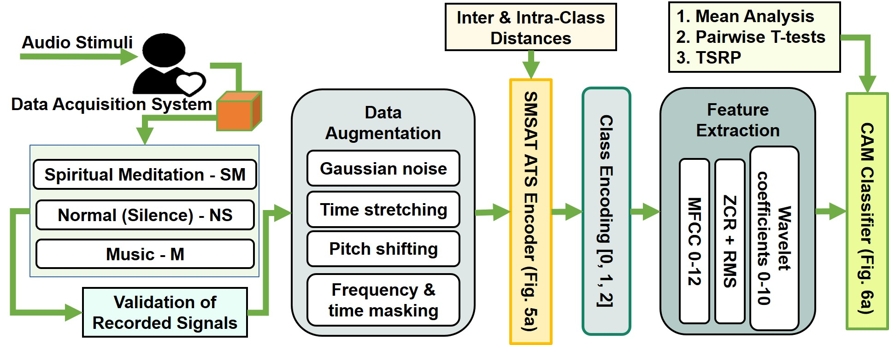

### Data Collection and Acquisition Device
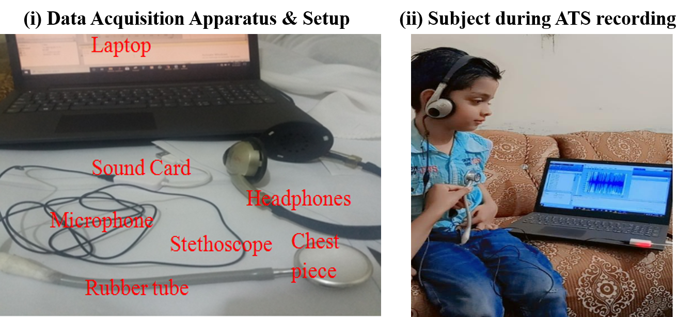

#### Time Domain 
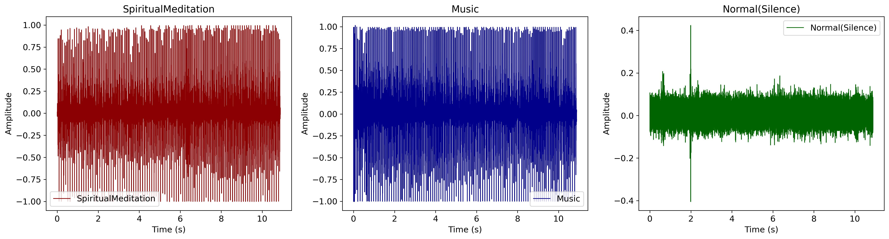

#### Dataset  Distribution
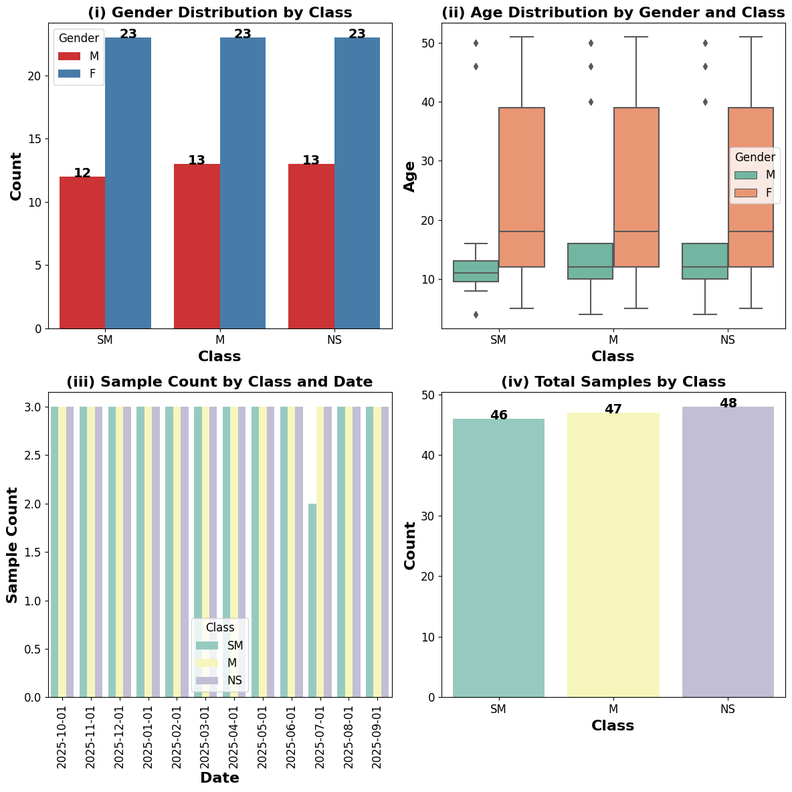

---
## Dataset Validation

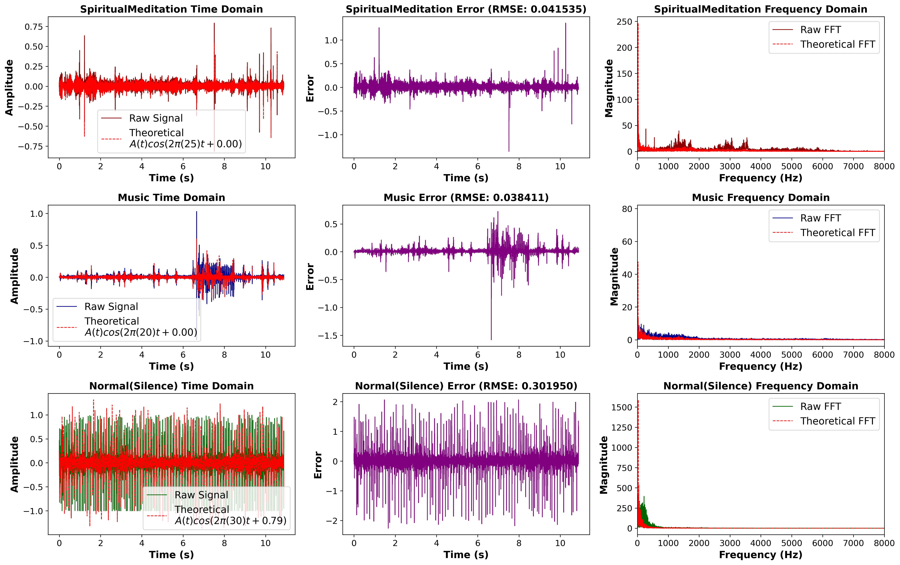

---
## PROPOSED SMSAT ATS ENCODER
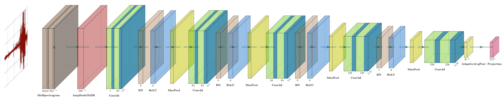

### Dataset Augmentation

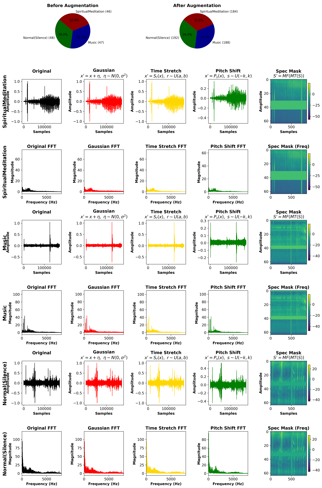
---
## CALMNESS ANALYSIS MODEL (CAM)

### Architecture
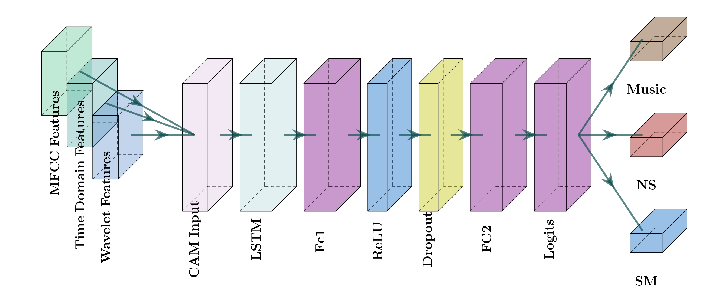

### Spiritual Meditation
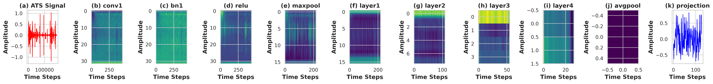

### Normal Silence
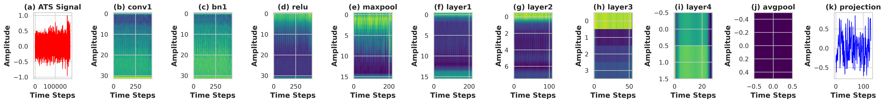

### Music
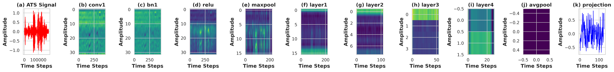
---
## 🚀 Getting Started

## Dataset
The dataset is hosted on Kaggle: 👉 SMSAT Dataset on Kaggle https://www.kaggle.com/datasets/crdkhan/qmsat-dataset/data

---

# 🌟 SMSAT WaveGAN Results

This repository presents the **WaveGAN-based augmentation results** for the **SMSAT dataset**, including training curves, generator/discriminator architectures, and quality evaluations for all three auditory classes.

## WaveGAN Architecture

| Generator | Discriminator |
|----------|---------------|
|  |  |

## Training Loss Curves

| NS Loss | Music Loss | SM Loss |
|--------|------------|---------|
|  |  |  |

## Classwise Generation Samples

| Music | Normal (Silence) | Spiritual Meditation |
|-------|------------------|----------------------|
|  | .png) |  |

## Signal Comparison Across All Classes

## Example Generated Output

## Generated Dataset Preview

## Summary

WaveGAN successfully produced class-consistent synthetic audio for **Music**, **Normal Silence**, and **Spiritual Meditation**, supporting balanced training and improved model stability.

---

##
📄 Citation
If you use this dataset or models, please cite:
@article{SMSAT2025,
  title={SMSAT: An Acoustic Dataset and Multi-Feature Deep Contrastive Learning Framework for Affective and Physiological Modeling of Spiritual Meditation},
  author={Ahmad Suleman and Yazeed Alkhrijah and Misha Urooj Khan and Hareem Khan and Muhammad Abdullah Husnain Ali Faiz and Mohamad A. Alawad and Zeeshan Kaleem and Guan Gui},
  journal={IEEE Transactions on Affective Computing},
  year={2025}
}

---

##
📧 Contact
For questions, reach out: crdteamwork786@gmail.com
