# 🌟 SMSAT WaveGAN Results

This repository presents the **WaveGAN-based augmentation results** for the **SMSAT dataset**, including training curves, generator/discriminator architectures, SHAP explainability, and classwise evaluation metrics.

---

## 📊 Subject-wise Cross‑Validation Performance

| Model / Classifier     | Accuracy (mean ± std) | F1-score (mean ± std) |
|------------------------|------------------------|-------------------------|
| **CAM (ours)**         | **98.4 ± 3.1**         | **97.9 ± 3.4**          |
| **SMSAT-Enc (ours)**   | 96.5 ± 3.8             | 96.2 ± 4.0              |
| wav2vec2.0 + Linear    | 81.7 ± 4.5             | 80.9 ± 4.2              |
| OpenL3 + SVM           | 78.5 ± 5.1             | 77.8 ± 5.3              |
| MFCC + SVM             | 69.3 ± 6.4             | 68.1 ± 6.9              |
| 1D CNN baseline        | 73.4 ± 5.7             | 72.6 ± 6.0              |

---

## 🧠 SHAP Explainability Results

### SHAP Beeswarm Plot
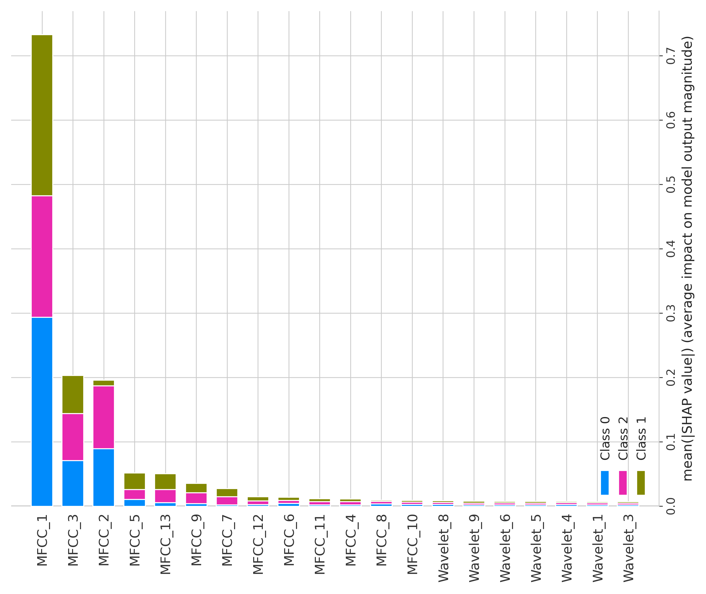

### SHAP Bar Plot
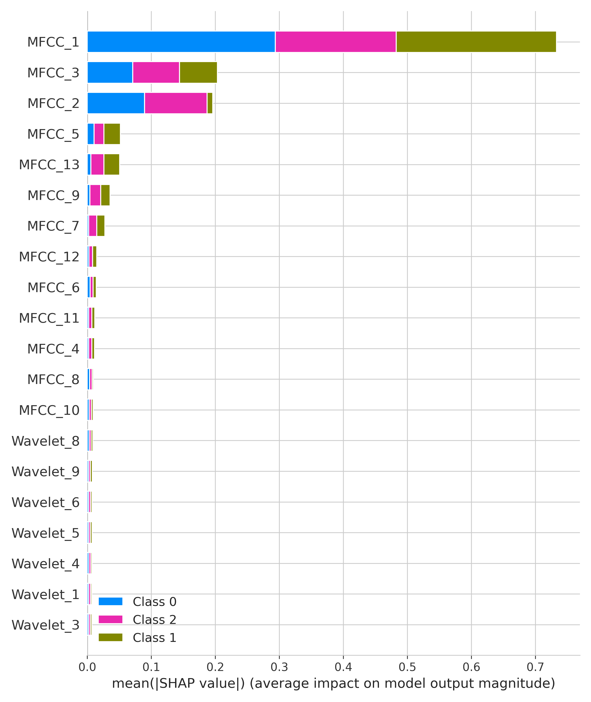

---

## 🏗️ WaveGAN Architecture

| Generator | Discriminator |
|----------|---------------|
| 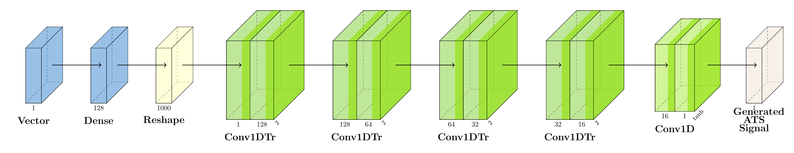 | 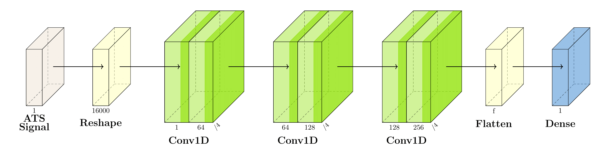 |

---

## 📉 Training Loss Curves

| NS Loss | Music Loss | SM Loss |
|--------|------------|---------|
| 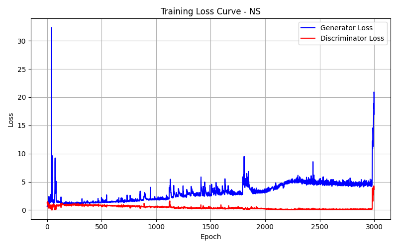 | 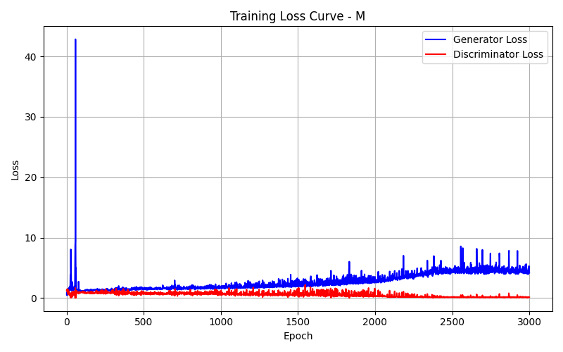 | 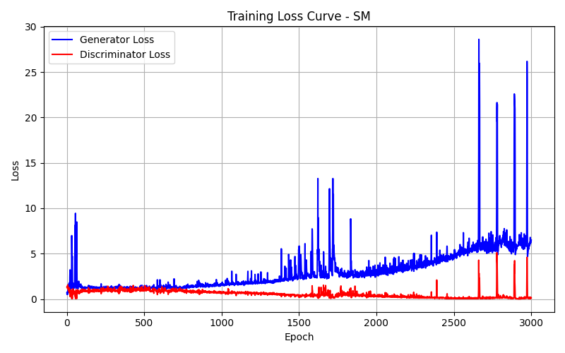 |

---

## 🎧 Classwise Generation Samples

| Music | Normal (Silence) | Spiritual Meditation |
|-------|------------------|----------------------|
| 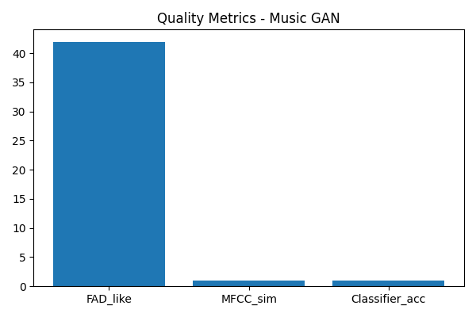 | .png) |  |

---

## 🔎 Signal Comparison Across Classes

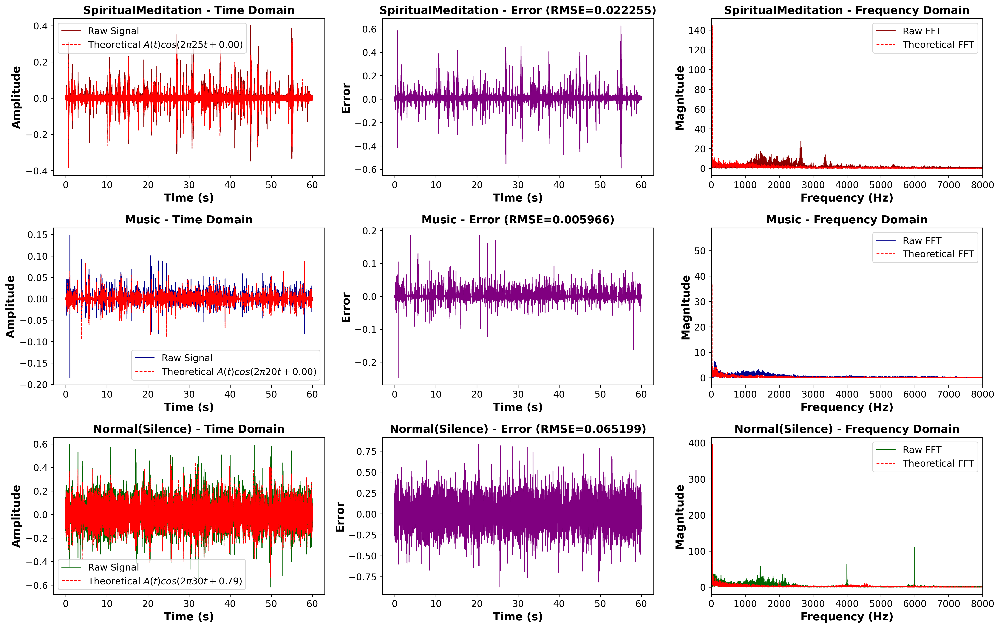

---

## 🧪 Example Generated Output

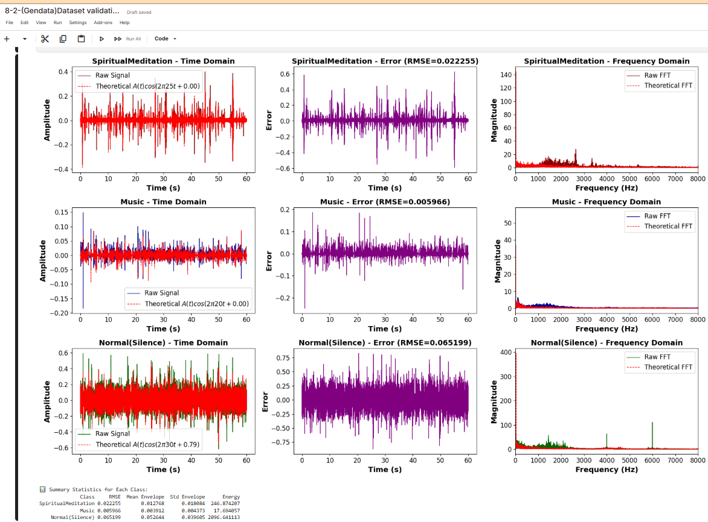

---

## 📦 Generated Dataset Preview

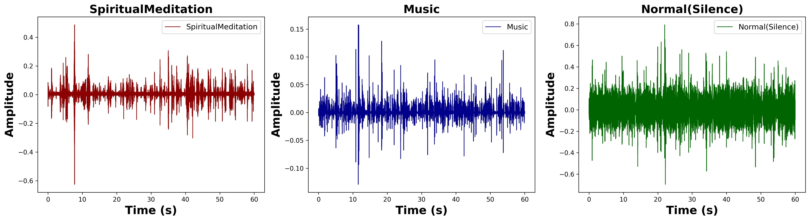

---

## ✨ Summary

WaveGAN successfully produced class-consistent synthetic audio for **Music**, **Natural Silence**, and **Spiritual Meditation**, strengthening class balance and improving model stability for CAM and SMSAT‑Enc.

